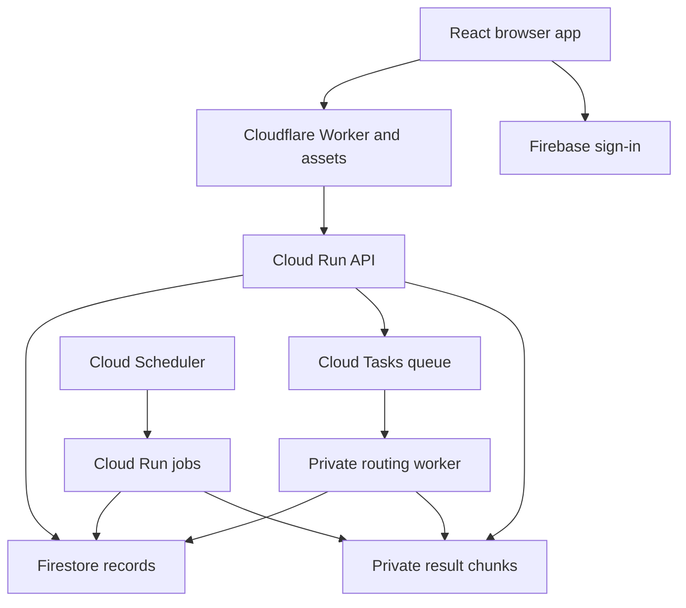

# Architecture

Keywise implements a branded public website, customer property-search dashboard and separate staff workspace. Presentation remains separate from account rules, route calculations and result ownership, so further animation and live integrations can be added without changing those boundaries.

## Data and control boundaries

`RouteDefinition` holds the confirmed destination, supported transport preferences, direction and explicit time assumption. `ViewState` holds housing filters, map bounds, sort order and selection. These are separate contracts: changing a view cannot trigger a routing request. Draft route settings remain separate from the definition attached to a completed or running dataset.

A standard run freezes listing IDs and versions before dispatch. Rent, bedroom and furnishing preferences do not prune this universe. Each custom run belongs to one authenticated account and its server-derived entitlement. Identical destinations requested by different people create separate runs; there is no cross-user custom-result matching or proximity reuse.

Popular profiles are explicitly maintained and published datasets. They have their own confirmed destination and route definition. A suggestion records an intended point for admin review; it does not promote a private run or initiate computation.

## Current local request flow

Vite serves the public website and proxies API requests to the local Node service. Customer and staff mock credentials create cookie sessions; the server checks account ownership, staff roles and request-forgery protection. The filesystem repository and blob store save synthetic inventory, popular profiles and private results. A synthetic queue handles explicit custom runs. The public saved-file viewer parses and filters snapshots locally without an API or account session. See [keywise-local-demo.md](keywise-local-demo.md) for routes and review accounts.

## Planned live deployment

The following deployment model and included adapters require approved configuration and live integration evidence. Firebase sign-in and the cloud services below are not active in the current local website.

The Cloudflare Worker serves the static Vite build and forwards only `/api/v1/` to a fixed HTTPS origin. It builds a fresh allowlisted header set, replaces any supplied edge credential, retains the Firebase bearer token, refuses origin redirects and sets no-store headers on every API response, including failures. All unknown `/api` paths return JSON errors instead of the SPA shell.

The API independently verifies the edge secret and Firebase identity token. An edge challenge is not an account identity. The API makes allowance and ownership decisions; neither client-supplied identities nor portable-file contents can grant rights. The public origin transport in the template relies on a random secret shared only by Worker and API. This arrangement must be tested against direct-origin requests. A future reviewed identity-based edge transport can replace it without changing application authentication.

The routing worker is a distinct Cloud Run service with IAM invocation restricted to the task service account. It also checks the Google-signed service token and audience. Cloud Scheduler calls the Cloud Run Jobs API with an OAuth token, because the scheduler target is a Google API. It does not use a browser API route to start jobs.

## Storage

Structured records sit behind repository interfaces. The local development store uses a bounded filesystem lock and fresh snapshots so local API and CLI job processes cannot overwrite each other's transactions. It is a development adapter; cloud services use Firestore transactions for durable coordination and private Google Cloud Storage objects for larger datasets. Neither a whole market nor a whole route run should be placed in a single Firestore document.

| Record group | Purpose |
| --- | --- |
| Accounts, identities, evidence, entitlements | Sign-in association and independently verified allowance ownership |
| Usage and idempotency | Atomic reservation/finalisation and retried-request protection |
| Listings and listing versions | Source provenance, precise/approximate location and frozen snapshots |
| Runs, candidates and batches | Private manifests, fixed coverage, progress and duplicate-delivery leases |
| Popular profiles and dataset manifests | Deliberate shared publication |
| Suggestions, audits and configuration | Review workflow and accountable privileged changes |
| Ingestion leases | Retry and overlap control for source processing |

Client Firestore and Firebase Storage access is denied by rules. The backend uses IAM, which these client rules do not restrict. GCS objects additionally use uniform bucket-level access and public access prevention; result delivery passes through API ownership/expiry checks. Do not add public object URLs to manifests or frontend state.

Application expiry takes effect on every read, independently of physical deletion. Cleanup must remove result chunks and their references without silently erasing accounting obligations. Cloud storage versioning, soft-delete, logging and backup policies must fit the approved retention policy, because application deletion alone cannot promise deletion from all replicas or backups.

## Provider extensions

Listing, location, routing, queue and storage operations are behind separate interfaces. Synthetic fixtures exercise supported workflows without pretending to be live data. A live provider requires both a tested adapter and its permission/configuration record. Source coordinates, independently provided addresses and routing-provider content retain separate provenance.

Route rows have explicit success, no-route, unresolved-origin, unsupported-settings and provider-error states. Missing duration is not zero. A matrix response never invents walking duration, transfer count or geometry. No decorative route line or synthetic contour is represented as a measured journey.

Description extraction is an ingestion concern. The extension uses constrained input/output data and no account, routing or arbitrary URL tools. Unknown facilities and provider room terminology remain explicit. No LLM call belongs in the view-filtering path.

## UI and motion extension points

Keep layout components, CSS tokens and visual transitions separate from fetch orchestration. Use stable listing IDs as keys and retain selected ID/filter state when changing list/map mode. Connect motion to observable state changes: destination confirmation, route progress, details selection and completed filtering. Do not move active controls during an animation or delay an authorised action until a decorative transition ends.

The default edge policy allows inline style attributes for marker positions and future motion, while disallowing inline scripts and eval. The optional Google map component is gated by browser configuration and a separate `GOOGLE_MAPS_ENABLED=true` edge binding. That deployment adds the documented Google hosts and the Maps runtime's eval capability; it still does not enable inline scripts. Live Maps/CSP behaviour has not been tested. Any other map or ad SDK requires a deliberate CSP update and integration review. Firebase popup authentication also needs staging tests with the approved auth domain. Reduced-motion and keyboard task completion are expected to survive future styling changes.

No ad network, purchase flow or referral billing system is active. The extension points must preserve organic ordering, counts, route values and direct source-link fallback. Private destinations and verification evidence never belong in analytics URLs, third-party requests or exported snapshots.

## Deployment isolation

Use independent Google/Firebase projects, service accounts, buckets, task queues, secrets and Cloudflare environments for development/staging/production. A separate Firestore database in the production project is insufficient separation for spend and broad project IAM. Keep preview Worker API disabled; a preview must not inherit production billing or provider configuration.

The repository pins dependency versions and includes the package-manager lockfile. Container deployments require an immutable image digest and numeric secret versions. Google/Firebase setup, domain routing and policy/contract approval remain operator-owned launch decisions; none are inferred from the Swiss launch context.
